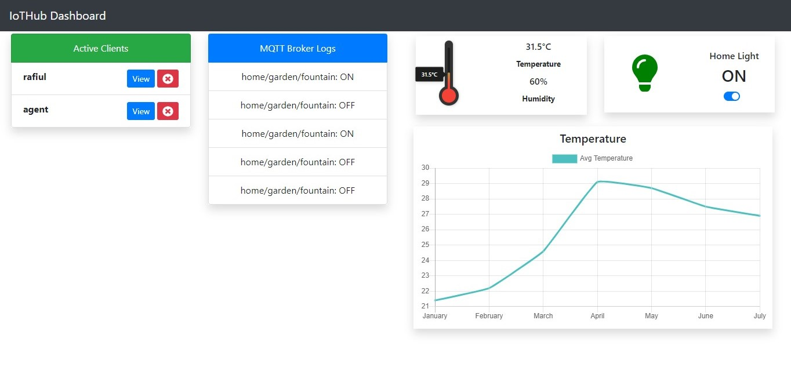
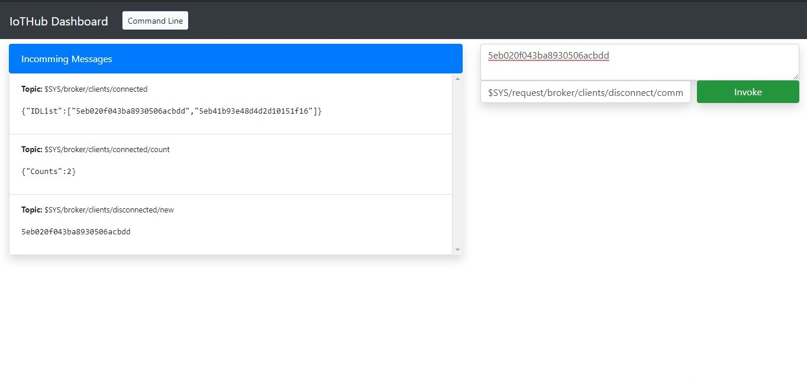

<h1 align="center">IotHub Dashboard</h1>
<h6 align="center">Interactive client to communicate with <a href="https://github.com/rafiulgits/iothub">IotHub</a></h6>

    

Smart Home Dashboard

    

Command Line Interface to communicate with MQTT broker with topic and payload request 

